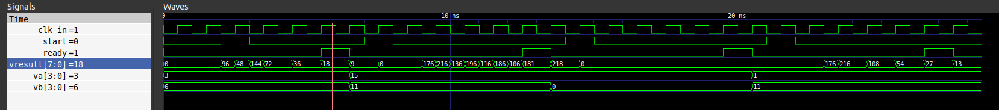

# Sistemas Digitais II - 2023

Esse repositório é destinado para a as atividades formativas da disciplina PCS-3225 (Sistemas Digitais II), no oferecimento 2023.2.

## Estrutura dos arquivos

- AtivN (N corresponde ao número da atividade formativa) -> Conjunto de arquivos utilizados em cada atividade. Contém arquivos fornecidos pelos professores e os códigos desenvolvidos.

    - Simulações -> Contém o resultado das simulações

- Atividades_zipadas -> Contém, zipados, os códigos desenvolvidos

- Relatos -> Contém os relatos de cada atividade

## Como rodar com GHDL e simular com GTKWave

Primeiro, entre no diretório de uma das atividades

``` bash
cd Ativ1
```

Se quisermos simular o arquivo `sum_shift_multiplier.vhd`, precisamos elaborar cada uma das entidades utilizadas por ele.

### Checar sintaxe (opcional)

``` bash
ghdl -s <arquivos .vhd>
```

Esse comando checa se há algum erro de sintaxe em cada um dos arquivos passados com argumento, mas não efetua nenhuma compilação.

### Analisar

``` bash
ghdl -a <arquivos .vhd>
```

Esse comando compila cada um dos arquivos passados como argumento. É importante fazer o mesmo para a entity da testbench.

### Buildar a testbench

``` bash
ghdl -e <nome da entidade da testbench sem .vhd>
```

Esse comando lista todas as configurações necessárias para a entidade funcionar e a "constrói". Se qualquer uma das entidades necessárias não tiver sido analisada anteriormente, ocorrerá um erro nessa etapa.

### Rodar a testbench

``` bash
ghdl -r <nome da entidade da testbench sem .vhd> --vcd=<nome de arquivo com extensão .vcd>
```

Ao rodar esse comando, todo o código da testbench é rodado, e aparecerão os prints no terminal. Para visualizar o resultado de forma gráfica, pode-se usar o GTKWave. O arquivo .vcd passado como argumento é o arquivo que contém a simulação.

``` bash
gtkwave <nome de arquivo com extensão .vcd>
```

Exemplo do sum_shift_multiplier: 

